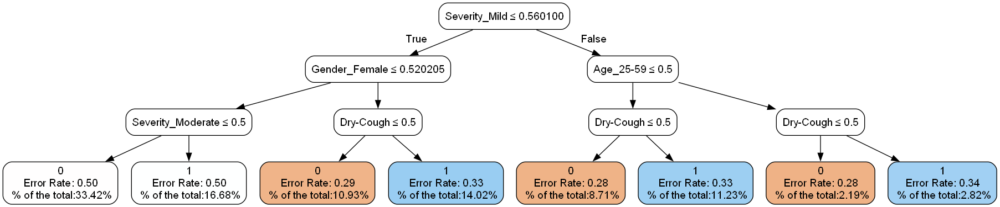

# TreeModelVis: Enhanced Tree-Based Model Visualization

TreeModelVis is a versatile Python toolkit for visualizing and customizing tree-based models, including decision trees
and ensembles like Random Forests and Gradient Boosting. Engineered for seamless integration with scikit-learn,
TreeModelVis delivers enhanced interpretability and detailed visualization capabilities, making it an indispensable tool
for model analysis and presentation.

## Features

- **Versatile Visualization**: Create detailed, customizable graphics to visualize decision trees and tree ensembles.
  

- **Out-of-Sample Data Analysis**: Evaluate out-of-sample data and compare its error alignment with the training error,
  offering insights into the model's generalization.
  

- **Data Distribution Insights**: Gain an understanding of data distribution and model decision patterns to improve
  interpretability.
  

- **Individual Decision Logic Analysis**: Utilize `draw_path` to visualize and understand the decision-making process
  for specific instances, providing deep insights into how models make predictions.
  

- **Worst Performing Path Identification**: Identify and analyze the paths within the model that result in the highest
  error rates, helping to pinpoint areas for improvement.
  

- **scikit-learn Integration**: Seamlessly integrates with existing scikit-learn workflows for a smooth user experience.

- **User-Friendly**: Designed with simplicity in mind, enabling both beginners and experienced practitioners to leverage
  its capabilities efficiently.

## Quickstart

To get started with TreeModelVis, install the package using pip:

```bash
pip install TreeModelVis
```

Or clone the repository:

```
git clone https://github.com/yourusername/TreeModelVis.git
cd TreeModelVis
import sys
from sklearn.model_selection import train_test_split
import pandas as pd
import os

sys.path.insert(0, os.path.abspath(os.path.join("TreeModelVis", 'source')))

from TreeModel import TreeModel
file_path = 'TreeModelVis/data/diabetes.csv'
df_diabetes = pd.read_csv(file_path)
X_diabetes = df_diabetes.drop('Outcome', axis=1)
y_diabetes = df_diabetes['Outcome']
X_train_diabetes, X_test_diabetes, y_train_diabetes, y_test_diabetes = train_test_split(
            X_diabetes, y_diabetes, test_size=0.2, random_state=42)
class_names_diabetes = ['No', 'Yes']
tree_model = TreeModel(
            model_type='decision_tree',
            model_params={'max_depth': 3},
            X_train=X_train_diabetes,
            y_train=y_train_diabetes,
            class_names=class_names_diabetes
        )
filename = os.path.join("graphical_output", "test_TreeModel_diabetes")
output_path = tree_model.custom_plot_tree(filename=filename)
print(output_path)
```

## Example Usage

For a hands-on introduction to TreeModelVis, including how to visualize decision trees and analyze model performance,
check out our [Example Notebook](example/Example_TreeModelVis.ipynb).

This notebook guides you through the steps of using TreeModelVis with practical examples, showcasing how to leverage the
toolkit for enhanced model visualization and interpretation. Whether you're a beginner or an experienced practitioner,
the notebook provides valuable insights into making the most out of TreeModelVis capabilities.


